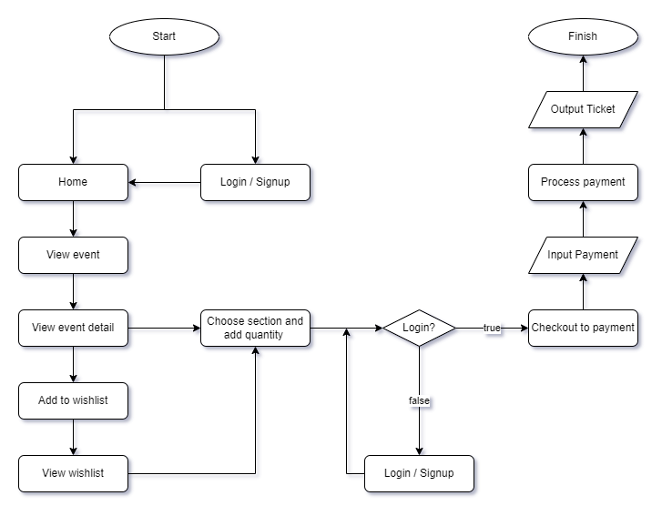

<h1 style="text-align:center">Karcis Project Backend</h1>

# Introduction

<div style="display:flex; flex-direction:row; column-gap:20px; margin-bottom:20px">


</div>

<h2>About The Project</h2>

Karcis Project is a web application that provides a transactions service for event booking.

<h2>Installation</h2>

1. Clone the repository below and open the file using [VSCode](https://code.visualstudio.com/download)

```sh
$ git clone  https://github.com/billhikmah/karcis-project-server
```

2. Install NPM packages

```sh
$ npm install
```

3. Add .env file at root folder project

4. Starting application

```sh
$ npm start
$ npm run startDev
```

5. Karcis Project App is Running

<h2>Deploy</h2>

This client side has been created with Express.js framework and deployed on [Example]()

    ```
    https://karcisproject.example.app/ (example)
    ```

<h2>Package</h2>

In addition to using the Express.js framework, this frontend is also supported by this following packages:

1. [bcrypt](https://www.npmjs.com/package/bcrypt)
2. [cloudinary](https://www.npmjs.com/package/cloudinary)
3. [cors](https://www.npmjs.com/package/cors)
4. [dotenv](https://www.npmjs.com/package/dotenv)
5. [jsonwebtoken](https://www.npmjs.com/package/jsonwebtoken)
6. [morgan](https://www.npmjs.com/package/morgan)
7. [multer](https://www.npmjs.com/package/multer)
8. [eslint](https://www.npmjs.com/package/eslint)

<h2>Appliaction Flow</h2>
<div style="display:flex; justify-content:center; margin-bottom:40px;">
    
</div>

1. Client (Frontend)<br>
   Client documentation can be accessed via [Netlify]() or [Github Repository]().

2. HTML & CSS (Frontend)<br>
   The client side also has been documented with HTML & CSS and deployed on [Netlify](=).

3. Postman<br>
   The API has been documented with on [Postman](https://documenter.getpostman.com/view/20723287/VV51tET9).
